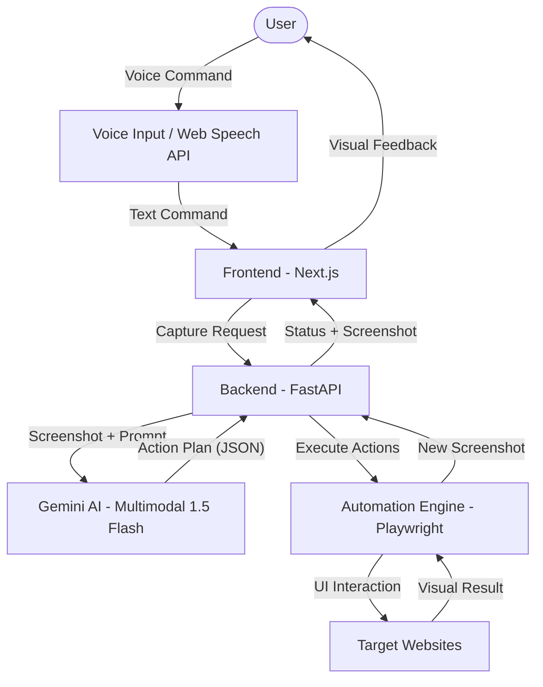

# ScreenPilot Architecture

## System Components

1.  **Frontend (Next.js)**: Provides the user interface, handles voice-to-text conversion using the Web Speech API, and polls the backend for task status and screenshots.
2.  **Backend (FastAPI)**: Orchestrates the agent loop. It manages the Playwright browser instance, communicates with Gemini, and tracks task progress.
3.  **Gemini AI**: Uses the `gemini-1.5-flash` multimodal model to analyze screenshots and generate structured action plans (JSON).
4.  **Automation Engine (Playwright)**: Executes the generated actions (click, fill, navigate) on the target websites.
5.  **Multimodal Loop**: The system captures the current state of the UI, analyzes it with the user's intent, and executes a step-by-step plan until the goal is reached.
